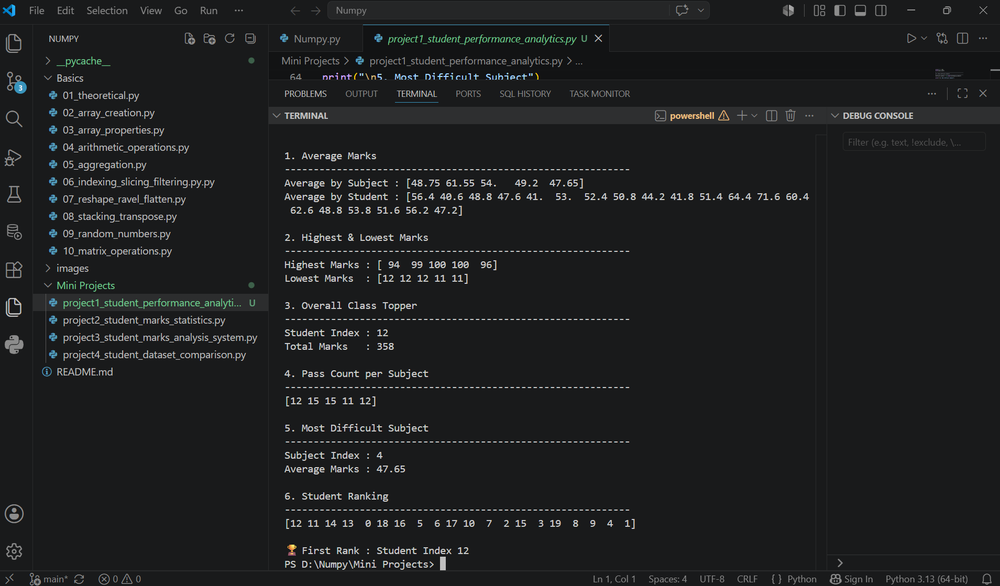
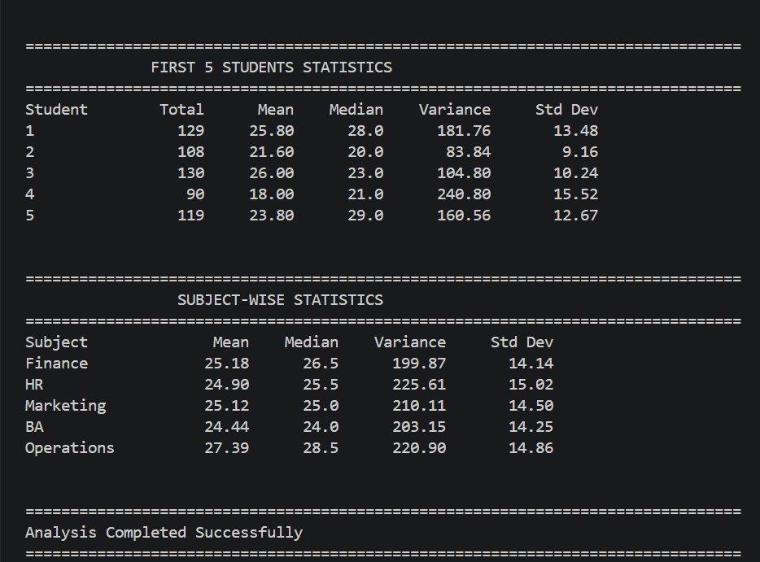
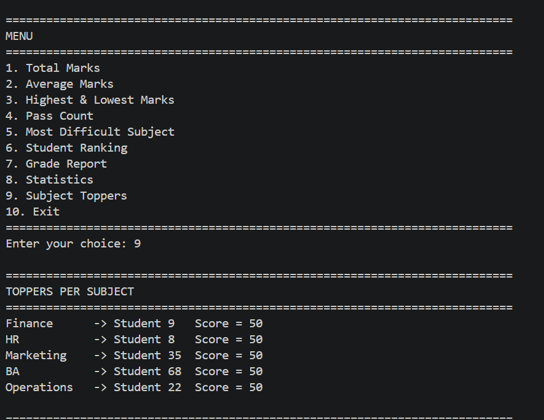
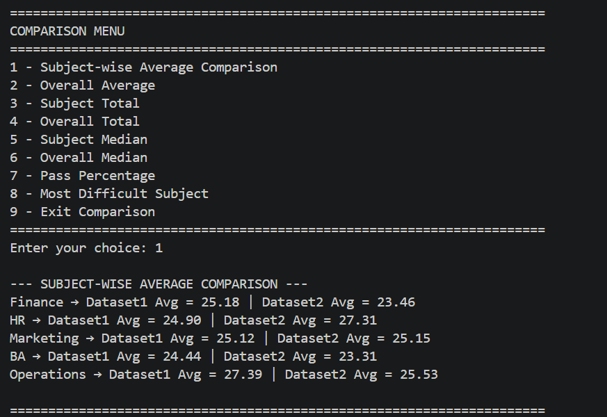

# 🔢 NumPy Essentials with Real-World Mini Projects


---

# 📖 Project Overview

This repository documents my hands-on learning journey with **NumPy**, the fundamental library for numerical computing in Python.

It covers essential NumPy concepts including array creation, indexing, slicing, broadcasting, aggregation, reshaping, matrix operations, random number generation, and statistical analysis.

To strengthen my understanding, I also developed **four real-world mini projects** that apply these concepts to student performance analysis.

This repository serves as both a learning resource and a practical portfolio demonstrating my NumPy skills for Data Science and Machine Learning.

---

# 📚 Topics Covered

- Array Creation
- Array Properties
- Indexing & Slicing
- Boolean Indexing & Filtering
- Arithmetic Operations
- Broadcasting
- Aggregation Functions
- Matrix Operations
- Matrix Transpose
- Random Number Generation
- Random Distributions
- Reshaping Arrays
- Ravel & Flatten
- Stacking & Concatenation

---

# 🛠️ NumPy Functions Used

- `np.array()`
- `np.zeros()`
- `np.ones()`
- `np.full()`
- `np.sum()`
- `np.mean()`
- `np.median()`
- `np.var()`
- `np.std()`
- `np.max()`
- `np.min()`
- `np.argmax()`
- `np.argmin()`
- `np.argsort()`
- `np.reshape()`
- `np.ravel()`
- `np.flatten()`
- `np.concatenate()`
- `np.vstack()`
- `np.hstack()`
- `np.matmul()`
- `np.dot()`
- `np.random.rand()`
- `np.random.randint()`
- `np.random.normal()`
- `np.random.uniform()`
- `numpy.linalg.inv()`
- `numpy.linalg.det()`

---

# 📂 Repository Structure

```text
Numpy/
│
├── Basics/
│   ├── 01_theoretical.py
│   ├── 02_array_creation.py
│   ├── 03_array_properties.py
│   ├── 04_arithmetic_operations.py
│   ├── 05_aggregation.py
│   ├── 06_indexing_slicing_filtering.py
│   ├── 07_reshape_ravel_flatten.py
│   ├── 08_stacking_transpose.py
│   ├── 09_random_numbers.py
│   └── 10_matrix_operations.py
│
├── Mini Projects/
│   ├── project1_student_performance_analytics.py
│   ├── project2_student_marks_statistics.py
│   ├── project3_student_marks_analysis_system.py
│   └── project4_student_dataset_comparison.py
│
├── images/
│   ├── project1_output.png
│   ├── project2_output.png
│   ├── project3_output.png
│   └── project4_output.png
│
└── README.md
```

---

# 🚀 Mini Projects

## 📊 Project 1 — Student Performance Analytics

### 🎯 Objective

Analyze the academic performance of 20 students across five subjects using NumPy aggregation and ranking techniques.

### ✨ Features

- Subject-wise average marks
- Student-wise average marks
- Highest & lowest marks per subject
- Overall class topper
- Pass count per subject
- Most difficult subject
- Student ranking

### 🛠️ Concepts Used

- Aggregation Functions
- Boolean Indexing
- Statistical Analysis
- Ranking using `np.argsort()`

### 📸 Output



---

## 📈 Project 2 — Student Marks Statistics

### 🎯 Objective

Perform statistical analysis on a dataset containing marks of 100 students.

### ✨ Features

- Student-wise statistics
- Subject-wise statistics
- Mean
- Median
- Variance
- Standard Deviation

### 🛠️ Concepts Used

- NumPy Statistics
- Aggregation Functions
- Random Dataset Generation

### 📸 Output



---

## 🏫 Project 3 — Student Marks Analysis System

### 🎯 Objective

Develop a menu-driven application that performs multiple student performance analyses using NumPy.

### ✨ Features

- Total Marks
- Average Marks
- Highest & Lowest Marks
- Pass Percentage
- Student Ranking
- Grade Assignment
- Subject Toppers
- Median, Variance & Standard Deviation

### 🛠️ Concepts Used

- Functions
- Menu-Driven Programming
- NumPy Arrays
- Statistical Operations

### 📸 Output



---

## 📉 Project 4 — Student Dataset Comparison System

### 🎯 Objective

Compare two independent student datasets using NumPy statistical operations.

### ✨ Features

- Subject-wise Average Comparison
- Overall Average Comparison
- Subject-wise Total Comparison
- Overall Total Comparison
- Median Comparison
- Pass Percentage Comparison
- Most Difficult Subject Comparison

### 🛠️ Concepts Used

- Multiple Dataset Analysis
- Statistical Comparison
- NumPy Aggregation
- Menu-Driven Programming

### 📸 Output



---

# 💻 Skills Demonstrated

- NumPy Programming
- Array Manipulation
- Data Processing
- Statistical Analysis
- Matrix Operations
- Broadcasting
- Problem Solving
- Menu-Driven Python Applications
- Clean Code Organization

---

# 🎯 Learning Outcomes

Through this repository, I gained practical experience in:

- Creating and manipulating NumPy arrays
- Performing efficient numerical computations
- Applying statistical analysis to real-world datasets
- Using broadcasting and vectorized operations
- Building analytical mini projects using NumPy
- Writing clean, modular, and reusable Python code

---

# 🔮 Future Improvements

- Perform analysis using Pandas
- Visualize results with Matplotlib
- Export reports to Excel
- Build an interactive dashboard
- Extend the projects using Machine Learning techniques

---

# 👩‍💻 Author

**Nithya Sree**


Aspiring Data Scientist | Python | SQL | NumPy | Machine Learning

---

⭐ If you found this repository useful, consider giving it a star!